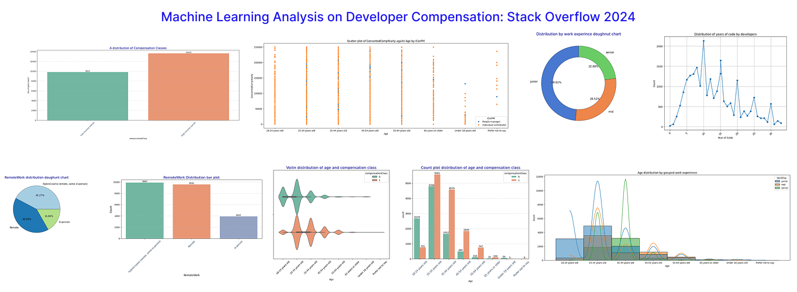

# Machine Learning Analysis on Developer Compensation: Stack Overflow 2024

## Project Description

This project (coursework) focuses on applying various machine learning (ML) models to analyze and predict developers' annual compensation. The study leverages data from the "Stack Overflow 2024 Annual Developer Survey", which captures information about the annual salaries of developers from diverse countries, industries, skills, and experience levels. 

The primary objectives of this coursework include performing Clustering Analysis (Unsupervised Learning) to group developers based on similar compensation patterns, Classification (Supervised Learning) to categorize developers into high and low-income groups, and Regression Analysis (Supervised Learning) to predict their annual compensation. 

## Tools Used

    
    
    
    
    
    

## Data Understanding

The dataset consisting of 113 columns and 65,437 rows, with 13 numerical and 100 categorical columns. 17 columns were selected for analysis, consisting of 16 features and 1 target variable, based on their relevance to developer compensation and domain knowledge.

## Data Preprocessing
In the initial data preparation phase, the following tasks were performed:

1. **Data Loading and Inspection:** The dataset was loaded and initially inspected for understanding its structure and key features.

2. **Handling Duplicate Values:** Any duplicate rows were identified and removed to ensure the integrity of the data.

3. **Handling Missing or Erroneous Values:** Missing or erroneous values were addressed using appropriate strategies, such as imputation or removal, depending on the nature of the data.

4. **Outlier Detection and Handling:** Outliers were identified and appropriately handled, either by capping or removing them, to prevent distortion in model performance.

5. **Data Formatting and Conversion:** Non-numeric columns were converted into appropriate numeric formats where necessary, ensuring compatibility with machine learning models.

## Exploratory Data Analysis
We shall be exploring the dataset in search for answers to the following key questions:

- **How does gender and age affect developers' salaries?** 

- **How do region and industry impact salaries?**

- **How do years of experience and years of coding influence developers' salaries?**

- **How does a developer's tech stack influence their salary?**

- **How does a work style influence their salary?**

## Results

After building our supervised (classification and regression) and unsupervised (clustering) models, here are the results of the models on the training set using various metrics and their performance:

- Clustering

- Classification

- Regression

## Challenges Ecncountered
Some of the challenges encountered while carrying out this project include:

- **Handling Missing Values:** Properly imputing missing data without introducing bias.
- **Outliers:** Identifying and managing outliers that could distort model performance.
- **Feature Engineering:** Creating meaningful features from raw data to improve model accuracy.
